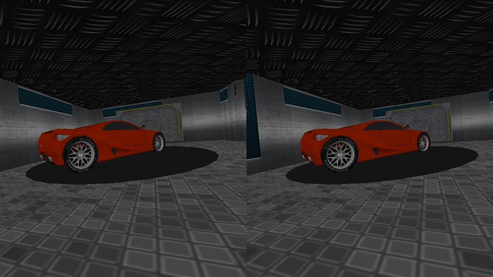
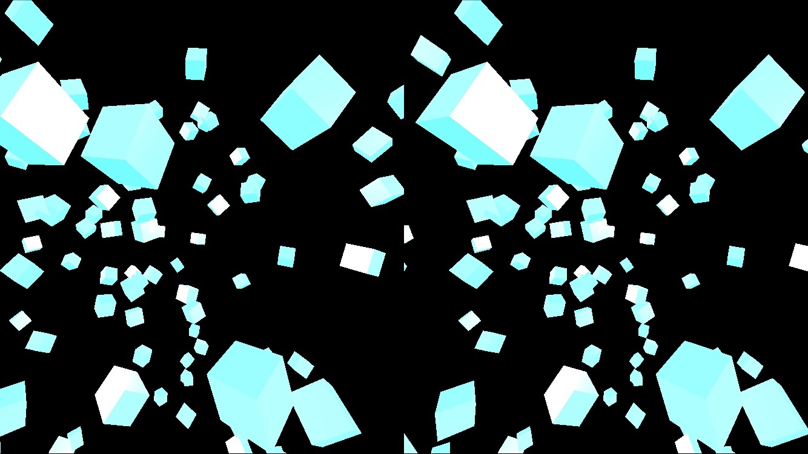

# Intergalactic VR

###### A virtual reality music experience created with Three.js and Web Audio

Designed for iOS/Android and Google Cardboard

[PLAY](http://sealions-vr.github.io)

---

### Team
* [Bao Tran](https://github.com/baottran)
* [Andrew Dye](https://github.com/adye20)
* [Ganesh Balaji](https://github.com/ganeshkbalaji)
* [Marko Anton Potocnik](https://github.com/antonpot)

April 2015 - Dev Bootcamp SF Sealions 

---

### Screenshots:

---

### Developer Notes

Let's put some code discussion here

---

### User Testing 

Pics of SeaLions 

---

#### Thanks! 

Team Photo? 

